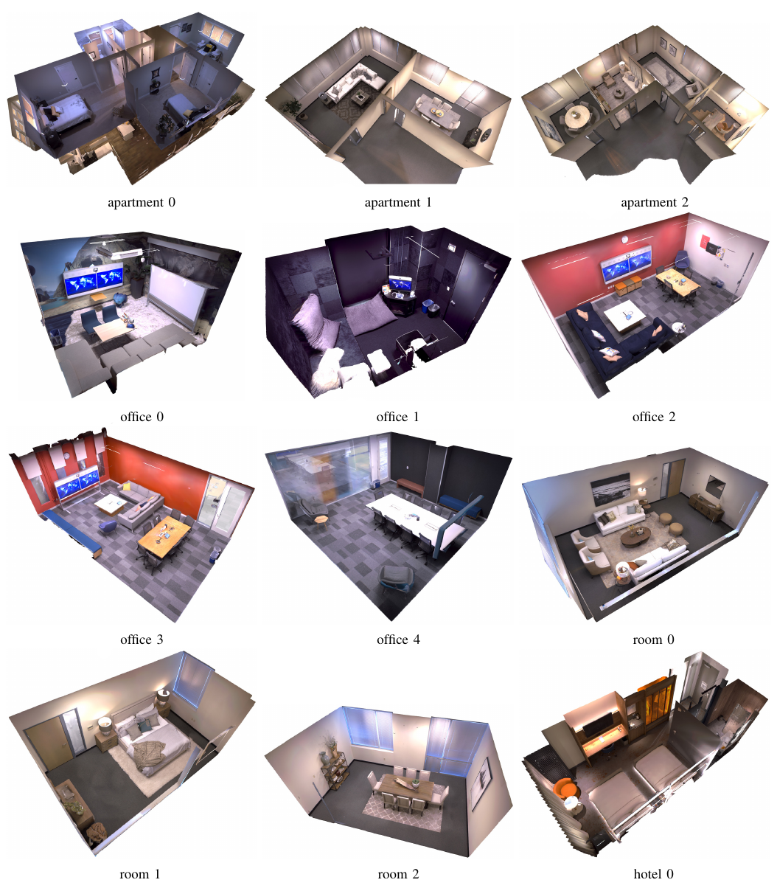
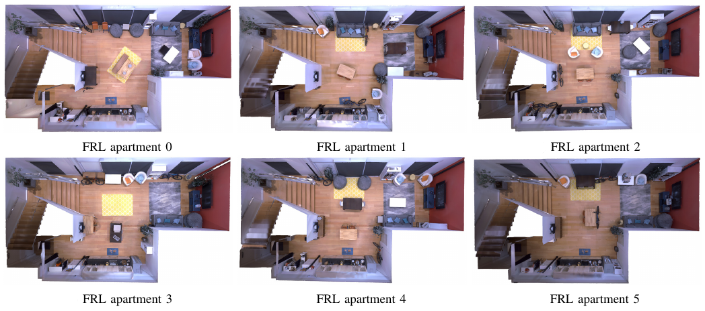
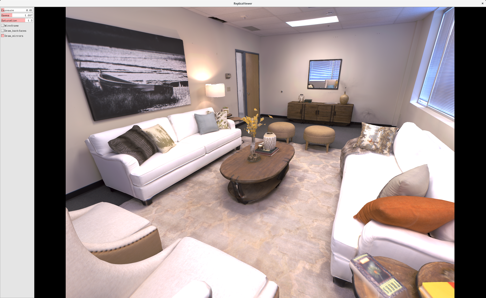

# The Replica Dataset
### [DagsHub Repo](https://dagshub.com/samuelkb/The_Replica_Dataset/src/main)

### Paper: [The Replica Dataset: A Digital Replica of Indoor Spaces](https://arxiv.org/pdf/1906.05797v1.pdf)


We introduce Replica, a dataset of 18 highly photo-realistic 3D indoor scene reconstructions at room and building scale. Each scene consists of a dense mesh, high-resolution high-dynamic-range (HDR) textures, per-primitive semantic class and instance information, and planar mirror and glass reflectors. The goal of Replica is to enable machine learning (ML) research that relies on visually, geometrically, and semantically realistic generative models of the world - for instance, egocentric computer vision, semantic segmentation in 2D and 3D, geometric inference, and the development of embodied agents (virtual robots) performing navigation, instruction following, and question answering. Due to the high level of realism of the renderings from Replica, there is hope that ML systems trained on Replica may transfer directly to real world image and video data. Together with the data, we are releasing a minimal C++ SDK as a starting point for working with the Replica dataset. In addition, Replica is `Habitat-compatible', i.e. can be natively used with AI Habitat for training and testing embodied agents.

# Replica Dataset

The Replica Dataset is a dataset of high quality reconstructions of a
variety of indoor spaces. Each reconstruction has clean dense geometry, high
resolution and high dynamic range textures, glass and mirror surface
information, planar segmentation as well as
semantic class and instance segmentation.
See the [technical report](https://arxiv.org/abs/1906.05797) for more details.


The Replica SDK contained in this repository allows visual inspection of the
datasets via the ReplicaViewer and gives an example of how to render out images
from the scenes headlessly via the ReplicaRenderer.

For machine learning purposes each dataset also contains an export to the format
employed by [AI Habitat](https://www.aihabitat.org/) and is therefore usable
seamlessly in that framework for AI agent training and other ML tasks.

## Citing the Replica Dataset

If you use the Replica dataset in your research, please cite the following
[technical report](https://arxiv.org/abs/1906.05797):

```
@article{replica19arxiv,
  title =   {The {R}eplica Dataset: A Digital Replica of Indoor Spaces},
  author =  {Julian Straub and Thomas Whelan and Lingni Ma and Yufan Chen and Erik Wijmans and Simon Green and Jakob J. Engel and Raul Mur-Artal and Carl Ren and Shobhit Verma and Anton Clarkson and Mingfei Yan and Brian Budge and Yajie Yan and Xiaqing Pan and June Yon and Yuyang Zou and Kimberly Leon and Nigel Carter and Jesus Briales and  Tyler Gillingham and  Elias Mueggler and Luis Pesqueira and Manolis Savva and Dhruv Batra and Hauke M. Strasdat and Renzo De Nardi and Michael Goesele and Steven Lovegrove and Richard Newcombe },
  journal = {arXiv preprint arXiv:1906.05797},
  year =    {2019}
}
```

## Replica Dataset

The following 18 scenes are included in this initial release:





Each Replica contains the following assets:

```
├── glass.sur
├── habitat
    ├── mesh_semantic.ply
    ├── mesh_semantic.navmesh
    ├── info_semantic.json
    ├── mesh_preseg_semantic.ply
    ├── mesh_preseg_semantic.navmesh
    ├── info_preseg_semantic.json
    ├── replica_stage.stage_config.json
    └── sorted_faces.bin
├── mesh.ply
├── preseg.bin
├── preseg.json
├── semantic.bin
├── semantic.json
└── textures
    ├── 0-color-ptex.hdr
    ├── 0-color-ptex.w
    ├── 1-color-ptex.hdr
    ├── 1-color-ptex.w
    ├── ...
    └── parameters.json
```

The different files contain the following:

- `glass.sur`: parameterization of glass and mirror surfaces.
- `mesh.ply`: the quad mesh of the scene with vertex colors.
- `preseg.json` and `preseg.bin`: the presegmentation in terms of planes and non-planes of the scene.
- `semantic.json` and `semantic.bin`: the semantic segmentation of the scene.
- `textures`: the high resolution and high dynamic range textures of the scene.
- `habitat/mesh*semantic.ply`: the quad meshes including semantic or presegmentation information for AI Habitat.
- `habitat/info*semantic.json`: mapping from instance IDs in the respective `mesh_*.ply` to semantic names.
- `habitat/mesh*semantic.navmesh`: navigation grid for AI Habitat.
- `habitat/replica_stage.stage_config.json`: configuration file defining scene level parameters for habitat-sim.
- `habitat/sorted_faces.bin`: binary file containing pre-processed geometry data for habitat-sim Ptex rendering support.

### Download on Mac OS and Linux

Make sure `pigz`, `wget`, and `unzip` are installed:

```
# on Mac OS
brew install wget pigz unzip
# on Ubuntu
sudo apt-get install wget pigz unzip
```

To download and decompress the dataset use the `download.sh` script:

```
./download.sh /path/to/replica_v1
```

### Download on Windows

Execute `win_download.bat` to download Replica.

## Replica SDK

### Setup

After installing the dependencies of [Pangolin](https://github.com/stevenlovegrove/Pangolin),
the Replica SDK can be compiled using the build script via

```
git submodule update --init
./build.sh
```

It requires the dependencies of
[Pangolin](https://github.com/stevenlovegrove/Pangolin) and
[Eigen](https://github.com/eigenteam/eigen-git-mirror)
to be installed. If you wish to use the headless renderer ensure you have the libegl1-mesa-dev package.

### ReplicaViewer

ReplicaViewer is an interactive UI to explore the Replica Dataset.

```
./build/bin/ReplicaViewer mesh.ply /path/to/atlases [mirrorFile]
```



The exposure value for rendering from the HDR textures can be adjusted on the
top left.

### ReplicaRenderer

The ReplicaRenderer shows how to render out images from a Replica for a
programmatically defined trajectory without UI. This executable can be run
headless on a server if so desired.

```
./build/bin/ReplicaRenderer mesh.ply textures glass.sur
```

## Replica and AI Habitat

To use Replica within AI Habitat checkout the AI Habitat Sim at [https://github.com/facebookresearch/habitat-sim](https://github.com/facebookresearch/habitat-sim).
After building the project you can launch the test viewer to verify that everything works:

```
./build/viewer --dataset /PATH/TO/REPLICA/replica.scene_dataset_config.json -- frl_apartment_0
```

## Team

Julian Straub, Thomas Whelan, Lingni Ma, Yufan Chen, Erik Wijmans, Simon Green, Jakob J. Engel, Raul Mur-Artal, Carl Ren, Shobhit Verma, Anton Clarkson, Mingfei Yan, Brian Budge, Yajie Yan, Xiaqing Pan, June Yon, Yuyang Zou, Kimberly Leon, Nigel Carter, Jesus Briales, Tyler Gillingham Elias Mueggler, Luis Pesqueira, Manolis Savva, Dhruv Batra, Hauke M. Strasdat, Renzo De Nardi, Michael Goesele, Steven Lovegrove, and Richard Newcombe.

## Contact

[Julian.Straub@oculus.com](Julian.Straub@oculus.com)

## Acknowledgements

The Replica dataset would not have been possible without the hard work and contributions of Matthew Banks, Christopher Dotson, Rashad Barber, Justin Blosch, Ethan Henderson, Kelley Greene, Michael Thot, Matthew Winterscheid, Robert Johnston, Abhijit Kulkarni, Robert Meeker, Jamie Palacios, Tony Phan, Tim Petrvalsky, Sayed Farhad Sadat, Manuel Santana, Suruj Singh, Swati Agrawal, and Hannah Woolums.

## License

See the LICENSE file for details.

### Note:

[Dagshub](https://dagshub.com) only can render on the site files of less than 20MB, in this dataset you can find a lightweigth model in the [office_1](https://dagshub.com/samuelkb/The_Replica_Dataset/src/main/data/office_1/mesh.ply) folder.
